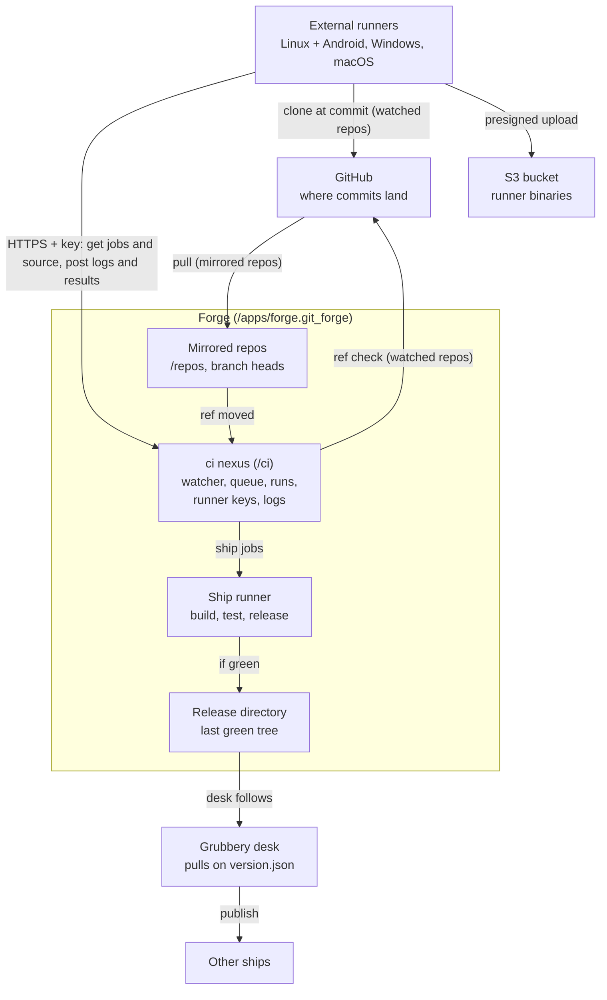

# Forge CI: architecture and implementation plan

Proposal, 2026-10-05. Not yet agreed with the maintainer.

## Summary and scope

Forge CI's main job is orchestrating the builds that cannot run on the ship: Linux, Android, Windows and macOS, on external runners. Hoon already builds easily, so ship-side CI comes last. The plan ships in five phases of code after one agreement gate, and the ship never holds a runner's binaries.

Version 1 delivers:

- External runners for Linux (with Android), Windows and macOS, each registered with an owner-minted key. They poll Forge for work, so build machines need no inbound port.
- Watched repos: CI for a GitHub repo with no copy in the ship. Forge checks the branch tip and reads only the workflow files, and runners clone from GitHub.
- Mirrored repos: Forge's existing repos, where an in-ship commit to a watched branch also starts a run and runners get the source from the ship.
- Workflow files in each repo at `.grubbery/workflows/*.json`, read from the commit being built.
- A run for every new commit on a watched branch, plus a manual run button.
- Logs kept in the ship. Binaries kept in S3-compatible storage.
- A CI panel per repo and a runners page in Forge.
- Last, native Hoon jobs: build, test, and a gated release that a grubbery desk follows. Clay deploys go through the existing `deploy_to_desk` tool.

Out of scope for version 1: iOS (Nomac keeps it), `git push` into Forge, job dependencies, build matrices, Forge-held secrets, containers, autoscaling, and pull-request builds (Forge has no pull requests).

## What Forge gives us today

Forge is a git client that mirrors GitHub, and CI can sit on top of it without changing its git code. References below are to `gwbtc/develop` at 40dbaf6, with paths relative to `desk/gub`.

- **Revisions are real git.** A repo is `/repos/<name>.git_repo`. SHA-1 packs, one grub per ref under `data/refs/heads` and `data/refs/remotes/origin`, and `HEAD` live under `data/`. Commits carry real hashes.
- **One serial lane runs every git verb.** `run.git-action` takes pull, commit, push, checkout, branch, add and stash. There is no merge.
- **Pull mirrors, it does not merge.** When new objects arrive, `save-repo` overwrites every local branch head with the remote tip and resets `HEAD` (`nex/git/repo.hoon:444`, `:725`). Local heads can jump, so CI keys runs by commit hash.
- **No inbound git.** Forge serves no smart-HTTP, so `git push` into Forge is impossible. The github proxy talks only to `https://github.com/<repo>.git` (`nex/github.hoon:237`). Forge's HTTP admits only the owner (`nex/git/forge.hoon:107`).
- **Repo changes arrive through polling.** `poll.json` pulls every N minutes and is seeded at 0, which means off (`nex/git/repo.hoon:42`). An in-ship commit advances the branch head (`nex/git/data.hoon:272`).
- **Detecting a change needs no clone.** The github proxy's `%discovery` request is `git ls-remote`: every branch's tip hash in one small response, with no objects. A pull starts with it and stops there when nothing moved. The proxy also makes GitHub REST calls with the ship's one token (its `calls/` directory).
- **Any fiber can watch any part of the tree.** A `keep` on a file or directory delivers news when a version moves. News carries versions, not content, so a watcher compares hashes itself.
- **Ordinary writes do not pile up history.** A write lands as `%temp` and tombs the previous `%temp` revision. Only snapshots are firm (`desk/app/grubbery.hoon:1759`). Each write is still one event in the log.
- **Building and deploying Hoon already exist.** Each write into a code namespace is a build. Grubbery desks follow a code directory and pull on a `version.json` change. Tools run as `/runs/<id>` grubs inside a sandboxed tools mount.
- **Some docs lag the code.** `forge.md` says push goes through the GitHub API, but it now uses receive-pack. `ratchet.md` says push is blocked, but `github-xfer` now has a 10-minute deadline. This drift is why code references should be pinned to a commit.

## Architecture

One new nexus, `git/ci`, lives at `/apps/forge.git_forge/ci` and holds everything CI owns. It sits beside `/repos`, not inside each repo, because runners and their queue serve every repo. Each mirrored repo's CI settings stay with the repo in a `ci.json`, the way `poll.json` holds its poll cadence.

Watched repos have no repo instance. Each is one grub, `ci/watched/<name>.json`, holding the GitHub repo, its watched branches, its poll interval and its owner settings.



The ci nexus is the only new directory in Forge's tree. The ship's runner and the external runners take jobs from its one queue, and desks follow only the release directory.

The ci nexus binds `/grubbery/forge/ci`. Eyre picks the longest matching prefix, so this bind wins over Forge's `/grubbery/forge` with no change to Forge's routing. Forge's own changes are one `%fall` row that mounts `/ci`, plus the new UI.

```
/apps/forge.git_forge/
  ci/                        neck [/git %ci]  (desk/gub/nex/git/ci.hoon)
    main.sig                 HTTP: owner API and runner API
    requests/                one grub per HTTP request
    watch.sig                the watcher: keeps /repos, starts runs
    seen.json                last commit seen per repo and branch
    watched/<name>.json      a watched repo and its settings
    storage.json             S3 endpoint, bucket and keys
    runners/<id>.json        name, labels, repos, key hash, seen, job
    queue/<run>.<job>        marker for an external job awaiting a runner
    runs/<run>/run.json      repo, branch, commit, workflow, trigger
    runs/<run>/<job>.json    job state; its fiber is the only writer
    runs/<run>/<job>/log/    append-only log chunks
    runs/<run>/<job>/code    ship jobs: the commit's tree, neck [/ %code]
    release/<repo>/<name>/   the last green tree, followed by a desk
    tools/                   tools mount seeded with the CI bundle only
  repos/<name>.git_repo/
    ci.json                  owner settings for this repo
```

A run's name is its creation date, so runs sort by time with no counter. Each job grub's fiber is the only writer of that job's state. HTTP routes and the watcher change a job by poking it, never by writing it. The newest 50 runs per repo are kept and older ones are culled.

## Workflow files

A workflow is a JSON file at `.grubbery/workflows/<name>.json` in the repo. CI reads it from the commit being built, not from the working tree, so a change to a workflow runs under its own rules. JSON is used because the tree has no YAML parser and `dejs` already reads JSON.

A desktop and mobile app built on all three runners:

```json
{
  "on": {"branches": ["main"]},
  "jobs": {
    "linux": {
      "runs-on": ["linux", "x86_64"],
      "steps": [
        {"run": "./build.sh"},
        {"upload": "dist/*.tar.gz"}
      ]
    },
    "apk": {
      "runs-on": ["linux", "android"],
      "timeout": 60,
      "steps": [
        {"run": "./gradlew assembleRelease"},
        {"upload": "app/build/outputs/apk/release/*.apk"}
      ]
    },
    "windows": {
      "runs-on": ["windows"],
      "steps": [
        {"run": "./build.ps1"},
        {"upload": "dist/*.exe"}
      ]
    },
    "macos": {
      "runs-on": ["macos"],
      "steps": [
        {"run": "./build.sh"},
        {"upload": "dist/*.dmg"}
      ]
    }
  }
}
```

| Field | Meaning | Default |
| --- | --- | --- |
| `on.branches` | Branch names that start a run. `"*"` matches every branch. Manual runs ignore it. | the repo's tracked branch, its config's ref |
| `runs-on` | `"ship"`, or a list of labels a runner must hold every one of | required |
| `path` | Ship jobs: the repo subtree to build | `code` |
| `steps` | Ship jobs: `tool` with `args`. Runner jobs: `run` (a shell command) or `upload` (a glob). | required |
| `shell` | Per runner step: `bash` or `pwsh` | `bash` on Linux and macOS, `pwsh` on Windows |
| `timeout` | Minutes before the job fails | 60 |

Jobs in one workflow run side by side. Ship jobs work only in mirrored repos, since a watched repo has no copy in the ship. A file that fails to parse still makes a run, with one failed job named after the file that carries the parse error, so a broken workflow is visible instead of silent.

## Triggers and run lifecycle

A run starts when a commit lands on a watched branch, whether a pull brought it from GitHub or it was committed in the ship. A branch is watched when a workflow's `on.branches` names it, and by default that is the repo's tracked branch. CI is off for a repo until the owner turns it on. A mirrored repo's commits from GitHub arrive only when its poll runs, so turning CI on there also requires a poll interval above zero.

**Watched repos.** The ci nexus polls each watched repo on its own timer, 5 minutes by default, with one `%discovery` call through the github proxy. That returns every branch's tip hash and no objects. When a watched branch's hash differs from `seen.json`, the nexus lists `.grubbery/workflows/` at that commit through the proxy's REST calls, using the GitHub contents API with the commit as `ref`. It reads each file and makes runs. Nothing else of the repo enters the ship.

**Mirrored repos.** The watcher, `watch.sig`, holds one keep on `/repos`. On each news it does three things for every mirrored repo with CI on:

1. Peek `data/refs/heads/*` and compare each hash with `seen.json`.
2. For each moved branch, read `.grubbery/workflows/` at the new commit and make a run for every workflow that watches the branch.
3. Write the new hash into `seen.json`.

The runs are made before `seen.json` is written. A crash between the two can make one duplicate run, never a skipped commit. The first time the watcher sees a repo it records the hashes without running anything, so turning CI on does not build old history. A keep on all of `/repos` also fires on editor saves and view rebuilds. Each costs a few peeks per CI repo (`ponytail: one keep on /repos; per-repo keeps on refs/heads if the noise shows up in profiles`).

Local branch heads are the trigger because both sources move them. An in-ship commit advances `refs/heads/<branch>` (`nex/git/data.hoon:272`), and a pull that brings new commits overwrites the heads with the remote's tips. Checkout and branch switches leave them alone. An in-ship push moves only the remote-tracking ref, so a pushed commit does not run twice. One wart carries over: a pull that brings new commits replaces an unpushed in-ship commit on the branch head. CI will already have run that commit, but the branch loses it, which open question 5 raises.

The owner can also start runs by hand. **Run now** builds a branch's current head commit, and **Rerun** makes a new run for the same commit.

A job is `queued`, then `running`, then `succeeded`, `failed` or `cancelled`, and a queued job can be cancelled before it starts. "Waiting for runner" is shown, not stored: it is a queued runner job with no online runner holding its labels. A run's status is derived from its jobs. A job fiber that restarts after a crash closes its job as `failed` with the crash text, as the git lane's `+rise-lane` does, so nothing shows as running forever. A runner job survives a ship restart: its fiber resumes waiting for the runner, and the runner keeps posting.

## Native Hoon jobs

Ship jobs come last, since Hoon already builds easily, and they work only in mirrored repos. A ship job is a list of tool calls, run in order inside the ci nexus's own tools mount. The first failing step fails the job and skips the rest. The ship counts as one built-in runner: a fiber in the ci nexus claims `runs-on: ship` jobs from the same queue external runners use, one job at a time, because every build runs in the ship's event loop. It serves every repo with CI on, so the repo check that limits external runners does not apply to it.

A ship job and a hoon-test-kit job in a mirrored repo's workflow:

```json
"jobs": {
  "desk": {
    "runs-on": "ship",
    "path": "code",
    "steps": [
      {"tool": "ci_build"},
      {"tool": "ci_test"},
      {"tool": "ci_release", "args": {"name": "calendar"}}
    ]
  },
  "unit": {
    "runs-on": ["linux", "fakeship"],
    "steps": [{"run": "./scripts/hoon-test.sh"}]
  }
}
```

Before the first step, the job checks out the commit's `path` subtree from the repo's git objects into `runs/<run>/<job>/code`, with neck `[/ %code]`. It never reads `data/tree`, so a poll during the run cannot change what is built. `.hoon` files are rewritten to the `%hoon` blot on the way in, as a desk's `+sync-release` does. Writing the tree is the build. Two pieces move into libraries so both callers share them: `+load-repo-maybe` from `nex/git/repo.hoon`, and that rewrite from the desk nexus.

Each step is one tools-nexus run: make `/runs/<id>` at `%start`, keep it, and read the result at `%done`, the pattern MCP uses (`nex/mcp.hoon:515`). The CI tools mount holds only these tools:

| Tool | What it does | It fails when |
| --- | --- | --- |
| `ci_build` | Reads the build result of every source file in the job's code namespace, using `check_bin`'s lookup | Any file has a build error. The log gets each file's tang. |
| `ci_test` | Reads every `lib/tests/*.hoon` artifact. Under `/lib/test.hoon` each compiles to `(list [name ok])`. | A test is false or a test file fails to build |
| `ci_release` | Writes the job's tree, as plain mime and in one bole, to `release/<repo>/<name>` | The repo's `ci.json` does not map `name` to this run's branch |
| `ci_deploy_clay` | Writes the tree into a Clay desk with `deploy_to_desk`'s walk and diff, moved into a library | The desk is not in the repo's `ci.json` `clay` list |

`ci_test` covers grubbery's own build-time tests. The app repos (lattice, calendar, orrery, furum) test with hoon-test-kit, whose suites use Clay imports and need a running fake ship. Those run as a Linux runner job with a `fakeship` label, as in the example above.

**Compiling once.** A build key hashes the source, its path within the namespace and its dependencies' keys (`desk/lib/build.hoon:462`), and compiled artifacts are shared across namespaces. When a desk later pulls the same tree, it should therefore hit the cache, and the ship compiles each release once. Phase 5 confirms this by timing the desk's pull after a green run.

**Gated release to a grubbery desk.** The owner points the desk's `source.json` at `/apps/forge.git_forge/ci/release/<repo>/<name>` instead of the repo's checkout. A desk follows any code directory, local or remote, so this needs no kernel change. `ci_release` writes there only after every earlier step passes. The desk still pulls only when `version.json` changes, so a release is still a version bump, as today. A red commit never reaches the desk, bumped or not.

**Other ships.** Publishing is unchanged. A desk shared with usergroups is followed by other ships, which pull on its version. Deploying to other ships is therefore the existing publish, now fed only by green builds.

**Clay desks.** `ci_deploy_clay` covers Gall agents. Installing the agent the first time stays a manual `install_app`.

## External runners

A runner is a small program on a build machine that polls the ship over HTTPS with its own key, so it needs no inbound port and no SSH. The ship's only inbound channel is eyre HTTP, since `/sys/iris/ws` makes outbound sockets only.

### Registration

1. The owner clicks **Add runner** and names it. Forge mints `<id>.<secret>`, shows it once with a ready config file, and keeps only a salted SHA-256 hash.
2. The owner puts the config on the machine and starts the service.
3. The runner calls `hello` with its protocol version, labels, OS, architecture and runner version. Forge refuses a protocol version it does not speak, so Forge and the runner can be released separately. It shows online from then on.

This is the agent-key design orrery and lattice already ship (orrery `docs/keys.md`). Their `+hash-token` and `+parse-bearer` are copied into a grubbery library. Revoking deletes the runner's grub, so its next request gets 401. Disabling keeps the key but hands it no jobs.

Keys are checked in the app, not by eyre. Requests under `/grubbery/forge/ci/runner/` must carry `Authorization: Bearer <id>.<secret>`, and every other route takes only the owner's cookie (`authenticated.req`), the way lattice's gate splits them (`code/nex/lattice/app.hoon:1116` in the lattice repo).

### Protocol

| Route (POST) | Body | Answer |
| --- | --- | --- |
| `runner/hello` | protocol, labels, os, arch, version | poll interval in seconds, or 426 for a protocol Forge does not speak |
| `runner/poll` | nothing | a job and its lease, or 204 |
| `runner/source` | job, lease | mirrored repos: a git pack of the job's commit |
| `runner/log` | job, lease, seq, text | `{"cancel": bool}` |
| `runner/upload` | job, lease, name, size, sha256 | a presigned PUT URL |
| `runner/done` | job, lease, status, artifacts | 200 |

**Claiming.** `poll` lists `queue/` and takes the oldest marker whose labels the runner holds and whose repo the runner may serve. It pokes that job with a claim carrying the runner id and a fresh random lease. The job fiber accepts only while the job is still queued, then culls the marker. The route reads the job back and returns it only if this runner now holds it, otherwise it tries the next marker. Later calls must carry the lease, like orrery's action claims, which other clients cannot touch while held. A job carries its repo (`owner/repo`), commit, branch, steps, timeout and run ids.

**Liveness.** The job fiber keeps its `log/` directory and arms a 5-minute deadline that each new chunk resets. The runner posts a chunk at least every 60 seconds, empty when the build is quiet. Five silent minutes fail the job as "runner lost". The workflow's `timeout` bounds the whole job.

**Cancelling.** The owner's cancel sets a flag on the job. The answer to the runner's next `log` carries `cancel: true`, so the runner kills the step's process tree and reports `cancelled`. No push channel is needed.

**Polling cost.** Every request is one event in the ship's log. Runners poll every 60 seconds and each poll stamps the runner's `seen`, so three runners make about 4,300 requests a day. A runner counts as online when seen within the last 3 minutes. Trigger latency is the repo's poll interval in minutes, so a faster runner poll would buy nothing (`ponytail: 60-second poll; long-poll if job pickup latency ever matters`).

### Getting the source

For a mirrored repo, the runner fetches the commit from the ship, not from GitHub, because an in-ship commit may not be on GitHub yet. `runner/source` answers with a git pack of the commit and every tree and blob it reaches. It is built with `write-pack` and the object walk `op-push` already does (`nex/git/repo.hoon:544`). The runner unpacks it into a fresh repository: `git init`, `git index-pack --stdin`, the commit's hash written to `.git/shallow`, then `git checkout <sha>`. Mirrored repos need no GitHub credential on the runner. The pack is uncompressed, since the ship has no deflate, so it is about the size of the tree (`ponytail: whole pack in one response, capped at 100 MB; stream it, or fetch pushed commits from GitHub, when a repo outgrows that`).

For a watched repo, the runner clones from GitHub at the job's commit: `git init`, `git fetch --depth 1 origin <sha>`, then `git checkout FETCH_HEAD`. A private repo needs the runner's own read-only credential, a deploy key or a fine-grained token in its git config. Forge never hands out the ship's GitHub token. Each job says which way to fetch.

### The runner program

- Go, standard library only. One source cross-compiles to Linux, Windows and macOS binaries. It lives in its own repo, `forge-runner`, because Forge will not always ship inside a grubbery install.
- Config file `forge-runner.json`: `ship`, `key`, `name`, `labels`, `workdir`, `env_file`.
- One job at a time. Each job gets a fresh directory under `workdir`, deleted afterwards. The service runs as a dedicated unprivileged OS user.
- `run` steps go through `bash -eo pipefail -c` or `pwsh -NoProfile -Command`. The environment carries `CI=true`, `FORGE_REPO`, `FORGE_SHA`, `FORGE_BRANCH`, `FORGE_RUN` and `FORGE_JOB`, plus the variables in `env_file`.
- `upload` steps hash each matched file, ask `runner/upload` for a URL and PUT the file straight to storage.
- It installs as a systemd unit on Linux, a launchd daemon on macOS, and a scheduled task at startup on Windows, which avoids a service library.

| Machine | Labels | Toolchain installed by hand |
| --- | --- | --- |
| Linux x86_64 | `linux`, `x86_64`, `android`, `fakeship` | git and build-essential; JDK 17 and the Android SDK for APKs; vere, a running fake ship, and bash, python3, socat, rsync and perl for hoon-test-kit |
| Windows x86_64 | `windows`, `x86_64` | git, PowerShell 7, Visual Studio Build Tools |
| macOS arm64 | `macos`, `arm64` | git, Xcode command line tools |

In version 1 labels are written by hand in the runner's config. Nothing detects them automatically.

## Artifacts and logs

Binaries go straight from the runner to S3-compatible storage, and the ship keeps only their records. Logs stay in the ship, capped per job. The silo holds file content in the loom and every POST body lands in the event log, so a binary sent through the ship would cost memory and log space twice.

### Artifacts

- **Storage.** Any S3-compatible bucket: DigitalOcean Spaces, AWS or MinIO. Its endpoint, region, bucket and keys live in `ci/storage.json`, with the same fields as the `s3.json` the MCP's S3 tools already read (`lib/tool-bundle/s3-tools.hoon`), so the owner can paste the same values.
- **Upload.** For each file, the runner asks `runner/upload`. The ci nexus answers with a presigned PUT URL valid for 15 minutes, for the key `forge/<repo>/<commit>/<run>/<job>/<name>`. The ship already signs SigV4 requests (`lib/tool-bundle/s3.hoon`). Presigning is the same signature carried in the query string: one new arm, tested against AWS's published example.
- **Record.** `runner/done` lists each artifact's name, key, size and SHA-256, and the job stores them. Anyone who downloads a file can check its hash.
- **Download.** The CI panel links `GET /grubbery/forge/ci/api/artifact`, which redirects to a presigned GET valid for 15 minutes. The bucket stays private.
- **Retention.** A lifecycle rule on the bucket expires old objects, so the ship needs no cleanup code. Keeping release binaries forever is deferred.
- **No storage set.** An `upload` step fails with "no artifact storage configured". Jobs without uploads still work.

### Logs

- Each `runner/log` POST becomes one new grub, `runs/<run>/<job>/log/<seq>`, which is never rewritten. The runner sends a chunk every 5 seconds or 64 KB, whichever comes first.
- A job keeps at most 2 MB of log in the ship. Past that, each chunk only rewrites a single overflow counter. That write still resets the liveness deadline.
- With storage set, the runner also uploads its full log as the artifact `log.txt`.
- Ship jobs write their step results and build tangs as chunks the same way.
- While a job runs, the CI panel fetches new chunks every 2 seconds.
- Logs leave with their run when the retention limit culls it.

## Security

Anyone who can push to the GitHub repo writes its workflows, so a workflow can ask for things but never grants them. Every grant lives in owner settings inside Forge.

**Owner settings per repo.** CI is off until the owner turns it on. The repo's `ci.json` names which releases may be written, from which branch, and which Clay desks may be deployed to:

```json
{"enabled": true, "releases": {"calendar": "main"}, "clay": ["calendar-staging"]}
```

A workflow that asks for a release or desk not listed here fails at that step.

**The ship.**

- The CI tools mount holds only the four CI tools. `git_cmd`, which could push, and the general file tools are not in it. Forge sets the mount's weir to what those tools need: read repo objects, write under `/ci`, and write Clay for `ci_deploy_clay`.
- Ship jobs compile code from the repo. Compiling and build-time tests have no side effects, but a hostile file can burn CPU and memory in the event loop. Only repos the owner turned on are built, one job at a time, and nothing under `runs/` ever runs as an app, since no bill is applied there.
- The ship's GitHub token and S3 keys never leave the ship. A runner gets one presigned URL per object, valid for 15 minutes.

**Runners.**

- A runner executes repo code, so treat its machine as exposed to everything the repo contains. Version 1 isolates with a dedicated OS user, a fresh directory per job and one job at a time. Containers and VMs come later. Never put a runner on the ship's machine.
- Secrets live only in the runner's `env_file`, and every job on that runner sees them. Each runner therefore carries an owner-set list of repos it may serve, empty meaning any. A runner holding signing keys should list only trusted repos. The same list decides which runners ever receive a private repo's source. A runner that builds private watched repos also holds its own read-only GitHub credential for them.
- A key can only claim jobs, write its own job's logs and results, read its own job's source, and ask for upload URLs. The lease stops it from writing to a job it does not hold.
- A stolen key can claim jobs and post false results or artifacts. Each artifact records the runner that built it, and revoking the key cuts the runner off on its next request.

## UI and API

CI lives inside Forge's existing page, with one new panel per repo and one new section on the landing page. The page code stays in Forge's `app.js` and `index.html`. Its data comes from the ci nexus's routes.

- **CI panel.** A fourth panel beside status, history and run (`nex/git/forge/index.html:58-60`). It lists runs newest first, with status, workflow, branch, short commit and subject, start time and duration. A run opens to its jobs, each with status, runner, steps, live log and artifacts. It has **Run now** (with a branch picker), **Cancel** and **Rerun** buttons.
- **History panel.** A status dot beside each commit, matched by hash.
- **Repo settings.** A CI section: on or off, releases and their branches, allowed Clay desks. Turning CI on while the poll is 0 asks for an interval first.
- **Runners.** A landing-page section beside the defaults editor. **Add runner** takes a name and an optional repo list, then shows the key once with a ready config file. The table shows name, labels, OS and architecture, online, last seen, current job, version, an enable toggle and a revoke button.
- **Storage.** The artifact bucket's settings, with the keys masked once saved.

Watched repos sit on the landing page beside repo instances. A **Watch a repo** form takes the GitHub repo, branches and poll interval. Each watched repo opens to the CI panel alone, since there is no tree to browse. Their routes are `GET watched`, `POST watched/add`, `POST watched/set` and `POST watched/delete`.

Owner routes under `/grubbery/forge/ci/api/`, behind the owner's cookie:

| Route | Does |
| --- | --- |
| `GET runs?repo=` | The repo's runs with their jobs |
| `GET job?run=&job=` | One job: steps, runner, artifacts |
| `GET log?run=&job=&from=` | Log chunks after a sequence number |
| `GET artifact?run=&job=&name=` | Redirects to a presigned download |
| `POST run` | Manual run of a repo's branch |
| `POST cancel` | Cancel a run or one job |
| `POST rerun` | New run of the same commit |
| `POST settings` | Write a repo's `ci.json` |
| `GET runners` | Runners, never their secrets |
| `POST runners/add` | Mint a runner and return its key once |
| `POST runners/set` | Enable, disable or change a runner's repos |
| `POST runners/delete` | Revoke a runner |
| `GET storage`, `POST storage` | Read with keys masked, or write |

## Implementation phases

Six phases, each a PR to `gwbtc/grubbery`. The runner gets its own repo, `forge-runner`. Phase 0 is a gate: no code until the maintainer agrees on the layout. External builds come first, because orchestrating them is the hard part, and Hoon on the ship comes last. Every phase is built and checked on a dev ship before it reaches a production ship.

| Phase | Delivers | Done when (on a dev ship) |
| --- | --- | --- |
| 0. Agreement | Answers to the open questions below: the `.grubbery/` path, the ci nexus at `/ci`, the workflow schema, where the runner lives | Path, placement and the runner's home were answered on 2026-10-05. The workflow schema still needs a look. |
| 1. Runners and watched repos | The ci nexus with its queue, runs, leases and log chunks; runner keys and routes; watched repos with the discovery poll and workflow reads; the CI panel and runners page; the Go runner on Linux | A push to a watched GitHub repo starts a run within one poll. The Linux job streams its log. Cancel stops it within one log interval. Killing the runner fails the job within 5 minutes. A revoked key gets 401. The ship holds nothing of the repo but its workflow files. |
| 2. Artifacts | Storage settings, the presign arm, upload and download | An APK built on the Linux runner downloads from the CI panel, and its SHA-256 matches. |
| 3. Windows and macOS | Install guides for both, a sample build on each | One Windows job and one macOS job each produce a downloadable artifact. |
| 4. Mirrored repos | The `refs/heads` watcher and `runner/source` | An unpushed in-ship commit to a watched branch builds on the Linux runner. |
| 5. Hoon on the ship | The ship runner, `ci_build`, `ci_test`, `ci_release`, `ci_deploy_clay`, the repo's CI settings | A broken `.hoon` file fails with its tang, and the fix goes green. A version bump on a red commit never reaches the desk. A Clay desk outside the list is refused. One app repo's hoon-test-kit suite passes on the `fakeship` runner. A desk pull after a green run is timed to confirm the compile is reused. |

Each phase leaves its checks behind: build-time tests in `lib/tests/ci.hoon` for workflow parsing and branch matching, the key-hash and bearer tests ported from lattice, a presign test against AWS's published example, and one Go test that runs the runner against an `httptest` server.

## Deferred and open questions

Each deferred item has a trigger for adding it. Questions 1 to 3 gated phase 1 and are answered. Questions 4 to 6 can wait for the phases they affect.

| Deferred | Add it when |
| --- | --- |
| A GitHub webhook to a keyed route that pokes `pull` | The poll interval is too slow a trigger. It cuts latency from minutes to seconds for one route and an HMAC check. |
| Commit statuses posted back to GitHub through the proxy | People review on GitHub and want to see CI there |
| Fetching pushed commits from GitHub instead of the ship | A mirrored repo outgrows the 100 MB source pack and cannot become a watched repo |
| Job dependencies (`needs`) | A deploy has to wait for a platform build |
| Build matrices | One workflow needs many OS or version combinations |
| Forge-held secrets | Several runners have to share one secret |
| A container or VM per job | Before running repos you do not trust |
| More than one job per runner | Jobs queue while a runner's machine sits mostly idle |
| Long-polling | Job pickup latency starts to matter |
| Release binaries kept forever | Releases need permanent download links |
| Automatic label detection | Hand-written labels drift from what is installed |
| `git push` into Forge | Developers need to push without GitHub. It needs a smart-HTTP server on the existing pack reader and writer. |

Questions for the maintainer, the first three answered on 2026-10-05:

1. Is `.grubbery/workflows/` the right home, next to `.grubbery/docs`? **Answered: yes.**
2. Should CI be a child nexus of Forge at `/ci`, or an app of its own? **Answered: inside Forge.** The tools pattern agrees: CI is an engine Forge mounts, as it mounts `/tools`, and Forge serves the UI.
3. Should the runner's source live in `gwbtc/grubbery` or in a repo of its own? **Answered: its own repo, `forge-runner`.** Forge will not always ship inside a grubbery install, so the runner must not live in grubbery's repo. The two share only the versioned runner protocol.
4. Should `ci_test` also run hoon-test-kit suites in the ship, or is a Linux runner the long-term home for them?
5. Pull overwrites local branch heads with the remote tips. With in-ship commits driving CI, that drops unpushed commits from the watched branch. Is that intended, or a bug to fix on its own?
6. Does writing identical content bump a grub's version? CI compares hashes either way, but the answer decides how noisy the `/repos` watch is.
